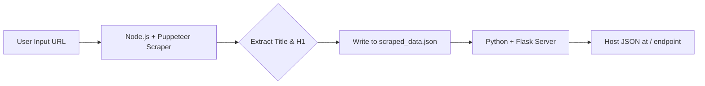

# DevOps & SRE - Multi-Stage Scraper & Server

This project shows how to combine Node.js and Python in a clean,multi-stage Docker build:

- **Node.js** + **Puppeteer** for web scraping
- **Python** + **Flask** for serving scraped data
- A lean final image using only what’s required in runtime

It dynamically scrapes the title, first heading (`<h1>`) and metadata of any URL provided at build time and serves it through a lightweight Flask API.

## Project Structure
---

## 📸 Architecture Diagram



## Technologies Used
- Node.js (18.x slim)
- Puppeteer (headless Chromium browser automation)
- Python (3.10 slim)
- Flask (for lightweight web API)
- Multi-stage Docker Build (for lean production images)

## Files Included

- `Dockerfile` – Multi-stage Docker setup
- `scrape.js` – Scraper using Puppeteer & Chromium
- `server.py` – Flask app to serve the scraped content
- `package.json` – Node.js dependencies
- `requirements.txt` – Python packages for Flask

## File Details
scrape.js
- Uses Puppeteer to:
  - Launch Chromium in headless mode
  - Navigate to the provided URL
  - Extract the page title and first H1
  - Write data to scraped_data.json

server.py
- Uses Flask to:
  - Read the generated JSON
  - Serve it at / endpoint

## How to Build the Image
Run the following command to build the image.
Use SCRAPE_URL to specify which website you want to scrape:
```bash
docker build --build-arg SCRAPE_URL=https://example.com -t scraper-server .
```

## How to Run the Container
Start the container and expose it on port 5000:
```bash
docker run -p 5000:5000 scraper-server
```

## How to Access the Output
Open your browser and go to:

Visit: [http://localhost:5000](http://localhost:5000)

You'll see JSON data similar to:

```bash
{
  "pageTitle": "My Awesome Site",
  "heading": "Welcome to My Site",
  "metaDescription": "This is a demo website for scraping."
}
```

## Example
```bash
docker build --build-arg SCRAPE_URL=https://wikipedia.org -t scraper-server .
docker run -p 5000:5000 scraper-server
```
Then visit http://localhost:5000 to view the scraped title and first heading.


## If you want to Scrape a Different Site
No problem! Just replace the SCRAPE_URL when you build the image:

Use `--build-arg` to specify a different target URL:

```bash
docker build --build-arg SCRAPE_URL=https://rahulkumar.online -t scraper-server .
```


## Final Container Details

- Uses a slim Python base for the final stage (clean and small)
- Only includes:
  - `scraped_data.json` — the output from the scraper
  - `Flask` — lightweight Flask app

## Health Check Endpoint

To verify if the container is running correctly:

- GET /health → {"status": "ok"}
Visit: [http://localhost:5000/health](http://localhost:5000/health)
